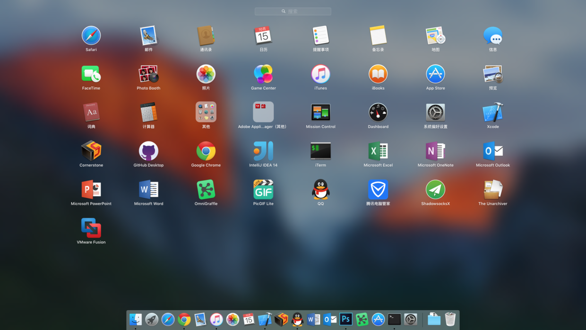

Launchpad图标大小怎么调整？，很多人觉得默认Launchpad的应用程序图标很大，空间比较拥挤，看起来一点也不精致，那么我们怎样才能调整Launchpad的图标大小呢？其实可以通过调整Launchpad每一行和每一列图标的数量，来调整Launchpad图标大小。

<!--more-->

Launchpad图标大小怎么调整？，很多人觉得默认Launchpad的应用程序图标很大，空间比较拥挤，看起来一点也不精致，那么我们怎样才能调整Launchpad的图标大小呢？其实可以通过调整Launchpad每一行和每一列图标的数量，来调整Launchpad图标大小。

接下来给大家介绍具体方法：

运行“终端”程序，执行以下命令：

1、调整每一列显示图标数量，7 表示每一列显示7个，在我的电脑上，7个个人觉得比较不错

defaults write com.apple.dock springboard-rows -int 7

2、调整每一行显示图标数量，这里我用的是8

defaults write com.apple.dock springboard-columns -int 8

3、由于修改了每一页显示图标数量，可能需要重置Launchpad

defaults write com.apple.dock ResetLaunchPad -bool TRUE;killall Dock

上面就是调整之后的效果，是不是精致了很多。

