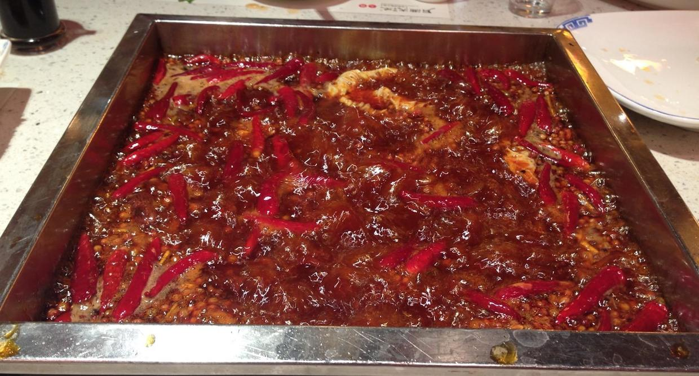
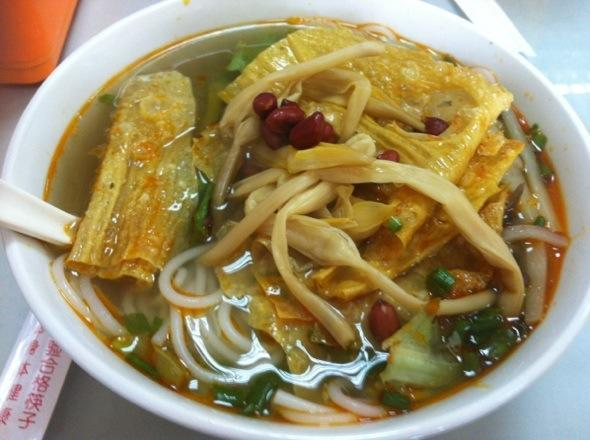
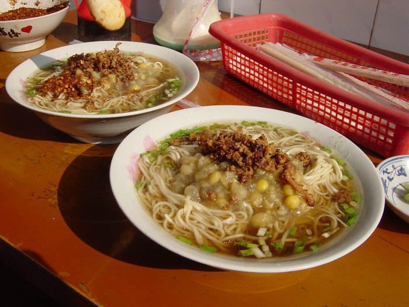
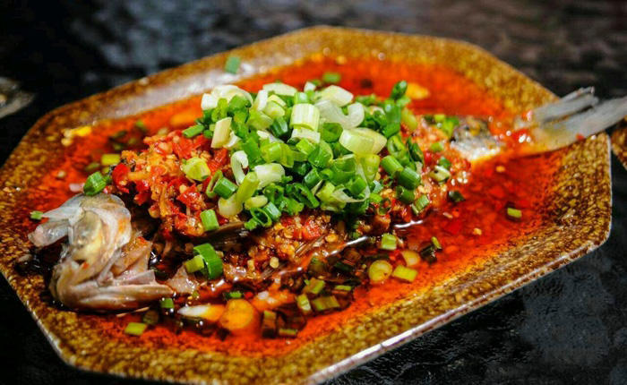
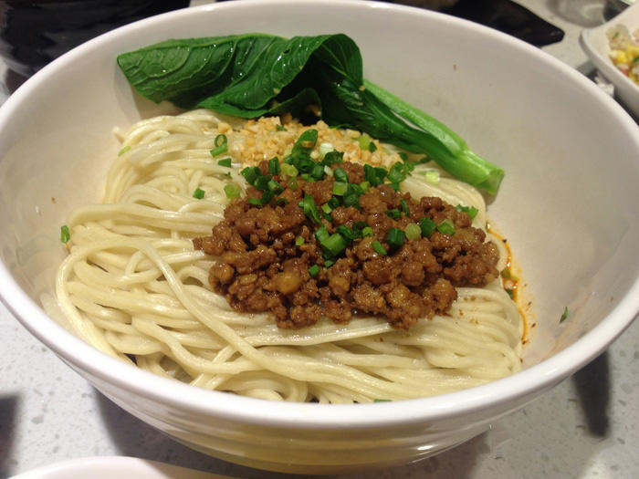
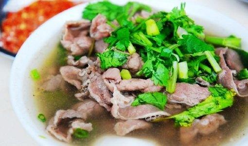
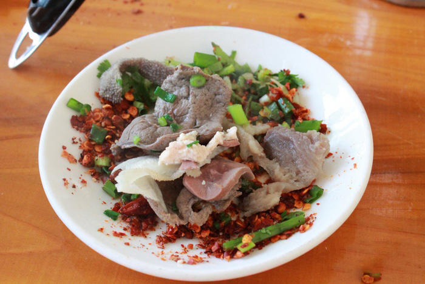
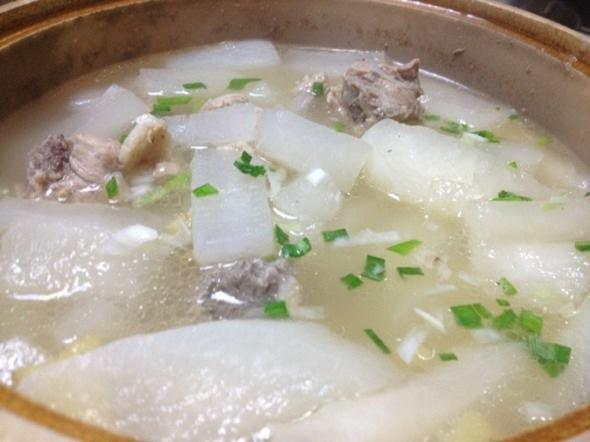
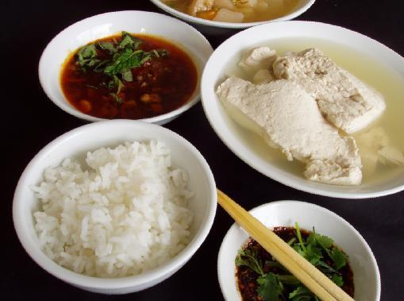
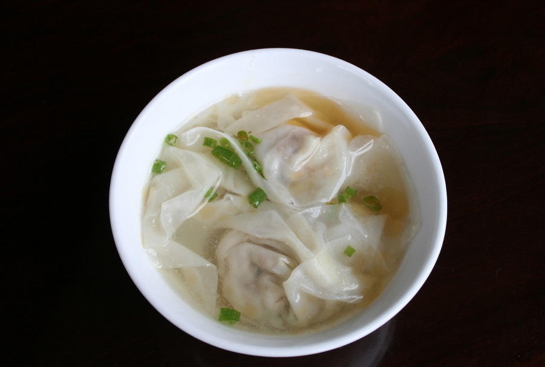

受学长的邀请，厚着脸皮来了四川开始了蹭吃蹭喝的一路，也正因为这样有了学长的引导，才能吃到很多只有当地人才知道的美食。整个蹭吃过程按地区来分，主要是成都，乐山，峨眉三地，好了，废话不多说，进入正题。

<!--more-->

## 红汤火锅

来到四川第一站是成都，也在成都吃到了正宗的红汤火锅，整个的感觉就是香、辣，辣的只有嘴辣，其他地方都是正常的，你应该懂得。

翻滚的油汤配上鲜辣的辣椒，光是味道就让人垂涎欲滴，最关键的蘸料，和自己平时习惯吃的芝麻酱还是很不同的，这里会有专门的蘸料，试用香油，蒜泥，盐，鸡精自己搭配而成，既可以削弱火锅的辛辣味道，还起到杀菌作用。

个人感觉最出色的配菜有，九转鸭肠，鲜鸭血，毛肚，千层肚，麻辣牛肉，耗儿鱼，脑花。

我们吃的这家店是月满大江火锅，位于成都科华中路。

## 螺蛳粉

螺蛳粉严格上是属于广西的特色，但是在成都去火车站的路上作为简餐吃了一顿，觉得有必要稍微介绍一下，可能有一些朋友没有吃过。

螺蛳粉给人最大的印象就是走过店门前，会有一股臭哄哄的味道，非常难闻，但是真正吃起来之后倒也不错，对我个人来说还是比较喜欢的味道。其主要原料就是米粉，腐竹，酸笋，炸花生，生菜，黄花菜，泡椒等，不妨体验一下，但是要注意一点，吃完之后会浑身带味，如果是约会之前那最好还是不要接触的好。

## 豆汤面

在成都第二天的早饭，吃的比较特色的豆汤面，味道还不错，算是四川各种重口味美食中比较清淡可口的一道。

按照百度百科所说，豆汤面做法如下：用人工制成面条，配料选用上等大白豌豆，用冷水泡透用中火炖粑不脱壳，肉末用鲜猪肉肥瘦切成小可粒，加甜酱炒香成脆绍，加汤回软。面汤用猪大骨熬制而成。苗条下锅用开水煮飘锅，熟后起锅装入汤碗，舀一勺肉末盖面上，再舀一勺粑豌豆盖绍面上，清淡可口，适合各种口味人群，老少皆宜。

## 鲫鱼

这里要说的是一家餐厅了，名叫鲫鱼堂，位于乐山市中区，单品凉拌鲫鱼广受好评，只可惜那一天晚上没有点，点的鲫鱼汤和另一种鲫鱼，忘记了具体的菜名，以及番茄排骨汤和牛蛙，都是非常不错的。

此店位于楼顶露天，夏秋之际于楼顶，伴着星空，吃着美味，也是极好的。

## 干绍面

俗话说，美味寻于市井，就是说很多特色美味只有在街边小店才能体验得到。对我来说，此行中，最满意的面条就是干绍面。

最重要的也许就是绍子的做法，选质地好的芽菜与碎肉一起翻炒，加入调料炒熟之后放入面条之上，干伴着来吃，面条也是非常好吃的面条。

## 跷脚牛肉

跷脚牛肉也许是乐山对外最有名的菜，当然也是极好吃的，我们是在看完乐山大佛之后，专门驱车赶往苏稽镇一家不起眼的小店，吃正宗的跷脚牛肉。

鲜美的大骨汤，配上美味的牛肉或者牛杂，牛肚之类的，蘸着美味的干辣椒，真是人间美味。

干辣椒沾着吃！干辣椒沾着吃！干辣椒沾着吃！重要的事情说三遍，最重要的就是经过油淋的干辣椒，配上香菜，盐，一伴，一碟美味的蘸料就诞生了，可以说没有了蘸料，跷脚牛肉就损失了一大半的味道。

## 萝卜汤

在乐山，最重要的是任何一个不起眼的蔬菜都能作为主打菜，比如萝卜汤。

萝卜汤可能看起来平淡无奇，我觉得最重要的事搭配其他菜，比如香而不腻的卤肉，酸甜可口的泡菜，里面有青椒、鲜姜、竹笋等，以及腊肠，这些东西配上萝卜汤，整顿饭都吃的香。

## 豆花饭

这个应该是最普通不过的家常豆花搭配以辣椒组合而成的美味。

豆花饭，搭配着血旺，非常不错。

## 抄手

抄手应该就是馄饨，但是这里的别有一番风味，清汤的，红汤的，馅都非常鲜美。

这里说的抄手，和上面说的干绍面是同一家店，位于宜必思酒店乐山中心店的对面。

未完待续...

