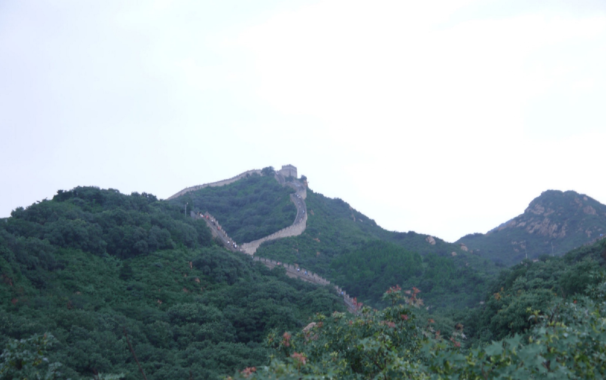

北京的大街，处处都可以看到各种小传单，什么长城十三陵什么什么一日游，而且价格都是诱人的低，比如120、100，有的甚至80、60、50，然后你就掐指头算一下，长城门票45，十三陵门票60，然后什么门票45，然后又是车接车送，哇，好便宜。

<!--more-->

好的，我这就来说一下为什么你看到的这么便宜。通常来说，都会有一个自称导游的人来给你推荐这些小传单，他会很确定的告诉你这些钱完全可以包你玩完所有这些景点，没有其他收费，然后有的人还会亲切的和你拉拉家常，然后会给你打包票到时是他带队，肯定不会骗你。那好，我们来确认一下这些人是不是导游，答案是肯定不是，他们只是一些旅行社的销售，也根本不会带队，和你这么说只是为了打消你的顾虑，这些人和跟团之后的导游没有任何关系，他们之间没有任何往来，这种行为的学名叫做散客拼团，这些人就是把散客聚集到一起组成一个团，然后旅行社在一个集散中心集中发车。听到这你会觉得这也无所谓啦，反正这点钱，跟哪个导游玩不是玩。嗯，然后我们再来说一下为什么会这么便宜，你在大街上看到这个价叫做散客拼团费，这个费用只是你拼成这个团给旅行社的费用，销售人员会从中抽取一部分提成，所以，他的提成高不高就看他的传单印的费用，比如他印了60，那他可能赚了10块钱提成，有的人比较狠，印了120，那他就可以赚70块钱的提成！这就是为什么你在大街上看到很多传单的价格都不一样。好了，这是散客拼团费，一般销售都会说这就是全部费用了。然后到了日子，你上车了，刚上车导游高高兴兴给你讲历史，讲文化，然后车走到了一个前不着村后不着店的地方，导游就开始收费了，你会突然发现，除了收这个大街上谈好的钱之外，还收了一个叫通票的钱，通票，就是游览所有景点的门票钱。这时候，你会很气愤，感觉被大街上那小子骗了，但这时导游的口才作用就显示出来了，他会把你说的气越来越小，然后你再想想，出都出来了，况且前不着村后不着店，没法回去，玩吧，于是，就把这两部分钱都交上去了。这就是基本去景点之前的所有收费了。

接下来我以长城-十三陵-皇家四合院-鸟巢水立方这个一日游的行程讲一下过程。

第一站长城。嗯，那是真真切切的长城，导游会在门口买所有人的门票然后所有人都高高兴兴的玩一下长城，这没什么，正常玩，就不说了。

下一站，十三陵。去十三陵的路上，导游首先会给你讲一下历史，但是，你不要以为是来学历史的，他讲一小点明朝历史之后，就开始讲蛇纹玉，一个神兽-貔貅，还有十三陵果脯。他会把这几个东西说的天花乱坠，各种好处都有。你这时候就开始纳闷了，我来十三陵你不给讲历史，讲玉、貔貅和果脯干嘛，如果你被他的演讲带入，那他就成功了...首先车进入十三陵，你发现没有在十三陵停下，而继续往后走，然后会跟你说不进去的原因（不进十三陵，当然就不需要十三陵的门票）。然后，就把你带到一个玉器城，里面全是蛇纹玉和貔貅，好了，你已经知道为什么在车上他要讲这个了，当然，没强制你买，买不买看你意愿。这一段结束，又把你带到一个超市，全是买果脯的，好的，这个你也明白为什么在车上会讲果脯了，果脯这，导游会稍微显可怜的明确的让你买一点，但也没强制，看你自己了...好了，十三陵游览到此结束，逛了一个玉器城和一个超市，十三陵没有进入（你心里一定在默默地骂，尼玛，老子在哪不能狂超市，还跑这来逛）。

十三陵之后，皇家四合院。去的路上，我在网上就一直没搜到这个景点，反正就是车跑了老远，然后不知在哪停下了，就到了传说中乾隆修养身心的地方。下车一看，我去，崭新的建筑，完全是刚刚修建，踏入大门，发现还有施工队在施工（这尼玛还没修完就急着赚钱了，当然，导游说这里被毁了是重建的，真假不知）。进去之后给你讲佛教相关，风水相关，算命相关，然后给你看相，诱你请各种护身符什么的，你懂得...

之后，车拉着你回市里，去鸟巢水立方，中途导游下车，说他们家在这，ok，到了鸟巢水立方，司机会跟你们说他要走了，这里交通方便，你们自己玩完了回去吧。好了，一天行程结束！

倒回来看看，这一天，两个票加起来200左右，正八经买过门票的就是长城，其他的根本就没有门票钱这一说，反而保不准你还花了不少（比如买玉啊，请貔貅啊，逛超市啊，请护身符啊）。

我上面说了比较坑爹的，然后有好的地方，就是早晨专车接到集散中心，免费坐了一天车等等...嗯，事实就是这些了。

